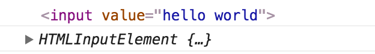
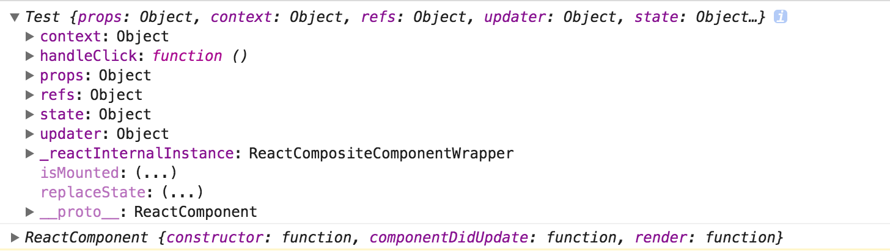
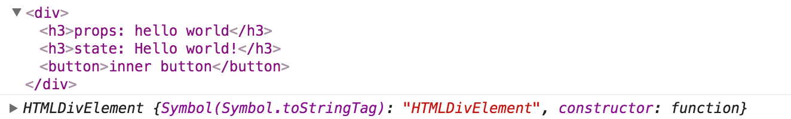
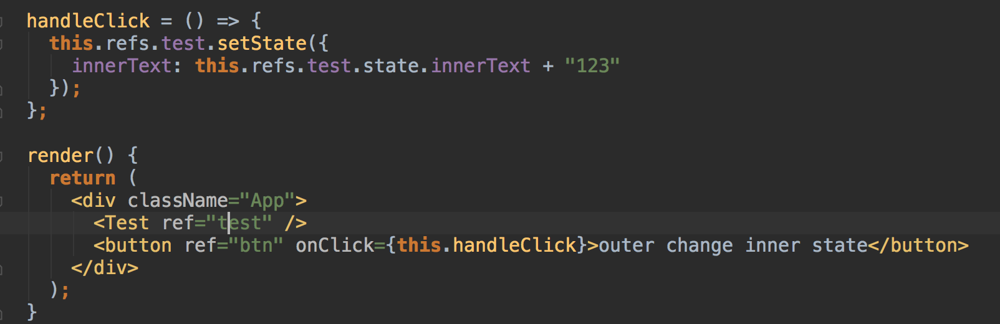
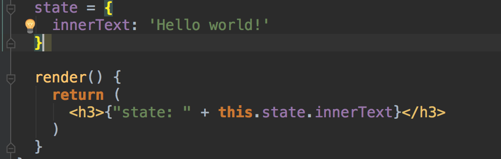
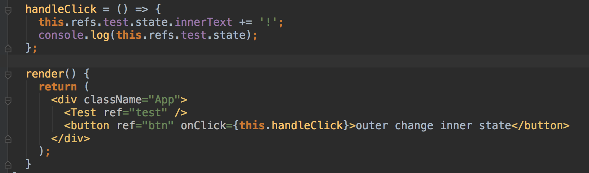
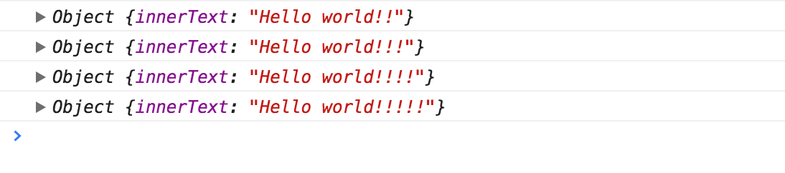
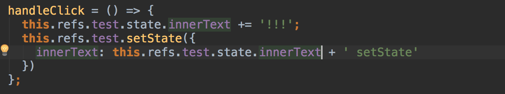

# 二、相关 API
- ReactDOM.findDOMNode(xxx)：获取 xxx 的 DOM 实例。
- JSX 中的 ref 属性：获取 React 中 DOM 元素或组件元素的实例。并添加到 this.refs 中。


# 三、例子
## 3.1 获取实例
### 3.1.1 DOM 元素的实例
- input 标签实例，是一个 HTMLInputElement 的实例。

```
componentDidMount() {
  let dom = this.refs.inputDom;
  console.log(dom);
  console.log(dom.__proto__);
}

render() {
  return (
    <div className="App">
      <input ref="inputDom" />
      <Test ref="testComponent" />
    </div>
  );
}
```



### 3.1.2 组件元素的实例
- test 组件实例，是一个 Test 对象的实例，继承自 ReactComponent。

```
componentDidMount() {
  let component = this.refs.testComponent;
  console.log(component);
  console.log(component.__proto__);
}

render() {
  return (
    <div className="App">
      <input ref="inputDom" />
      <Test ref="testComponent" />
    </div>
  );
}
```


### 3.1.3 实例的 DOM 实例
- DOM 实例，调用 ReactDOM.findDOMNode，依然返回该 DOM 实例。

```
componentDidMount() {
  let dom = this.refs.inputDom;
  console.log(ReactDOM.findDOMNode(dom));
  console.log(ReactDOM.findDOMNode(dom).__proto__);
}

render() {
  return (
    <div className="App">
      <input ref="inputDom" />
      <Test ref="testComponent" />
    </div>
  );
}
```


- 组件实例，调用 ReactDOM.findDOMNode，返回该组件的 DOM 实例。

```
componentDidMount() {
  let component = this.refs.testComponent;
  console.log(component);
  console.log(component.__proto__);
}

render() {
  return (
    <div className="App">
      <input ref="inputDom" />
      <Test ref="testComponent" />
    </div>
  );
}
```


## 3.2 操作实例
- 当获取了一个组件实例，我们就可以访问它下面的属性，并调用它的 API。
- 当然，**这不是 React 推崇的**。很容易打破组件的封装性，也容易使代码的逻辑不清晰。
- 但我们依然需要了解，这是对 React 更好的掌握。

### 3.2.1 通过引用，直接修改内部组件的 state。
- 外部组件


- 内部组件 Test


- 页面


- 点击 2 次按钮后的页面


### 3.2.2 如果直接修改 state 呢？
- 外部组件


- 多次点击后的页面



### 3.3.3 直接修改 state 后，如果加一个 setState 呢？



- 4.2 和 4.3 的例子中，为何会这样？这涉及到 setState 的机制了，简单说的话，没进入 setState 都不会更新组件。


