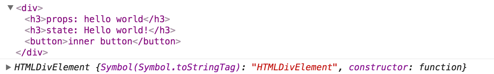

# 引子
- 众所周知，React 中创建的元素可以分为两类：DOM 元素和组件元素。而在我们的实际编程应用时，有时会需要去操作这些元素的实例。
- 比如：
	- 有时，我们需要关注表单中某一项，需要调用 input 标签 DOM 的 focus()；
	- 有时，我们需要取得某个组件的引用并作出相应操作，例如：Dialog，不过 Dialog 通常是不在文档流中的弹出框，往往直接渲染在 document.body 下。
	- 有时，我们需要获取 DOM 的尺寸、位置。
- 而在 React 中，JSX 是不会返回一个组件的实例的，所以我们需要了解 React 中组件的实例和引用的相应操作。

# 原理
## 一、背景
> React 0.14 版本开始，React 将 React 中涉及 DOM 操作的部分剥离开，目的是为了抽象 React，同时适用于 Web 端和移动端。

- 上述很好理解。0.14 版本之前，React 的设计思路为 App —— Virtual DOM —— DOM。可是，React 立志大前端，为了更方便的与其他平台集成，比如 React-Native 是基于 Virtual DOM 渲染出原生控件。因此，Virtual DOM 的映射输出，将由平台决定。在 Web 输出 DOM，在移动端输出 Android/IOS 控件。
- 因此抽离 ReactDOM 也更容易让人理解，Virtual DOM 可输出多种形式而不单单是 DOM，再将 DOM 放入 React 中就不合逻辑了。

## 二、基本 API
- ReactDOM.render()：将 Virtual DOM 挂载到浏览器 DOM 中。
- ReactDOM.findDOMNode(xxx)：获取 xxx 的 DOM 实例。
- JSX 中的 ref 属性：获取 React 中 DOM 元素或组件元素的实例。并添加到 this.refs 中。

## 三、基本例子
### 3.1 DOM 元素的实例
- input 标签实例，是一个 HTMLInputElement 的实例。

```
componentDidMount() {
  let dom = this.refs.inputDom;
  console.log(dom);
  console.log(dom.__proto__);
}

render() {
  return (
    <div className="App">
      <input ref="inputDom" />
      <Test ref="testComponent" />
    </div>
  );
}
```


### 3.2 组件元素的实例
- test 组件实例，是一个 Test 对象的实例，继承自 ReactComponent。

```
componentDidMount() {
  let component = this.refs.testComponent;
  console.log(component);
  console.log(component.__proto__);
}

render() {
  return (
    <div className="App">
      <input ref="inputDom" />
      <Test ref="testComponent" />
    </div>
  );
}
```


### 3.3 实例的 DOM 实例
- DOM 实例，调用 ReactDOM.findDOMNode，依然返回该 DOM 实例。

```
componentDidMount() {
  let dom = this.refs.inputDom;
  console.log(ReactDOM.findDOMNode(dom));
  console.log(ReactDOM.findDOMNode(dom).__proto__);
}

render() {
  return (
    <div className="App">
      <input ref="inputDom" />
      <Test ref="testComponent" />
    </div>
  );
}
```


- 组件实例，调用 ReactDOM.findDOMNode，返回该组件的 DOM 实例。

```
componentDidMount() {
  let component = this.refs.testComponent;
  console.log(component);
  console.log(component.__proto__);
}

render() {
  return (
    <div className="App">
      <input ref="inputDom" />
      <Test ref="testComponent" />
    </div>
  );
}
```


## 四、进阶例子
- 当获取了一个组件实例，我们就可以访问它下面的属性，并调用它的 API。
- 当然，**这不是 React 推崇的**。很容易打破组件的封装性，也容易使代码的逻辑不清晰。
- 但我们依然需要了解，这是对 React 更好的掌握。

### 4.1 通过引用，直接修改内部组件的 state。
- 外部组件


- 内部组件 Test


- 页面


- 点击 2 次按钮后的页面


### 4.2 如果直接修改 state 呢？
- 外部组件


- 多次点击后的页面


### 4.3 直接修改 state 后，如果加一个 setState 呢？


- 4.2 和 4.3 的例子中，为何会这样？这涉及到 setState 的机制了，简单说的话，没进入 setState 都不会更新组件。


