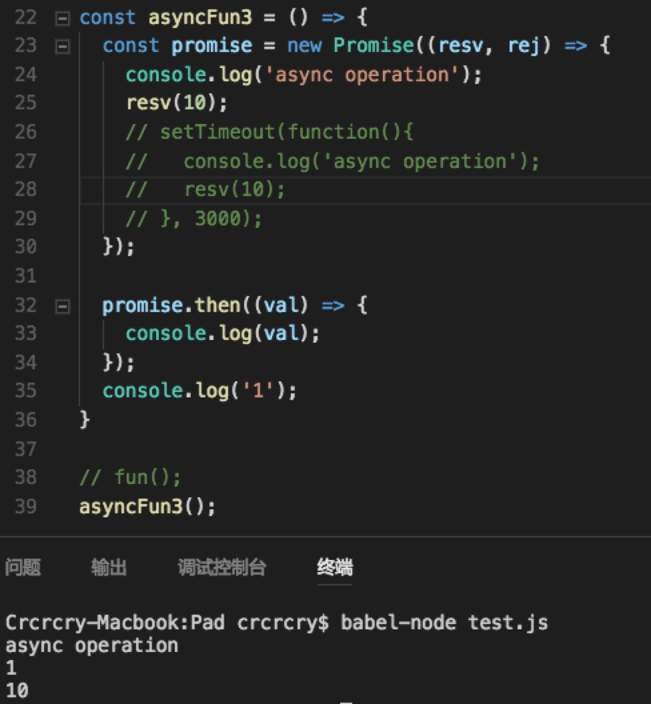
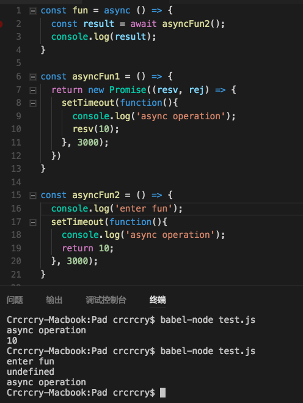

# 一、排坑
## 1.1 关于 JS 异步
- JS 中只有需要等待的才会产生异步代码执行，比如数据库查询、ajax请求。
- 只要在需要等待的操作得到结果的回调中插入自己的回调函数，即可保证函数顺序执行。
- new Promise 的 resolve 和 reject 函数用于改变 Promise 状态。then保证顺序执行。

## 1.2 Promise 原理


- new 一个 Promise 时会立即运行构造函数传入的函数，resolve/reject 时异步改变状态。

## 1.3 async/await 原理


- await 后跟的实际上都是 Promise 对象。
- await 表达式的返回值实际上是 await 后跟的 Promise 对象 resolve 时传递的参数。
- 换句话说，await 实际上 Promise.then() 的语法糖。
- 在上面的例子中：
	- 第一个函数中，由于 Promise 对象在 setTimeout 时状态仍旧是 pending，没有 resolve，所以没有到 then，await 尚未发挥作用。
	- 第二个函数中，setTimeout 中 return 没有什么意义，函数实际上最后有一个 return null，setTimeout 异步执行去了。

## 1.4 \_\_proto\_\_ 与 prototype
- 是什么
	- prototype：显式原型。
	- \_\_proto\_\_：隐式原型，JavaScript中任意对象都有一个内置属性[[prototype]]，在ES5之前没有标准的方法访问这个内置属性，但是大多数浏览器都支持通过\_\_proto\_\_来访问。ES5中有了对于这个内置属性标准的Get方法Object.getPrototypeOf().
- 二者的关系
	- 隐式原型指向创建这个对象的函数(constructor)的prototype
- 作用是什么
	- 显式原型的作用：用来实现基于原型的继承与属性的共享。
	- 隐式原型的作用：构成原型链，同样用于实现基于原型的继承。举个例子，当我们访问 obj 这个对象中的 xx 属性时，如果在 obj 中找不到，那么就会沿着 \_\_proto\_\_ 依次查找。

## 1.5 关于拓展运算符
- 拓展运算符用于变量拷贝，只能深拷贝第一层，深层是浅拷贝。


```javascript
const x = {
	a: 1,
	b: {
		c: 2,
		d: 3,
	}
}
	
const y = {...x}
	
y.b.c++;
console.log(x)
console.log(y)
```


# 二、尚未理解
