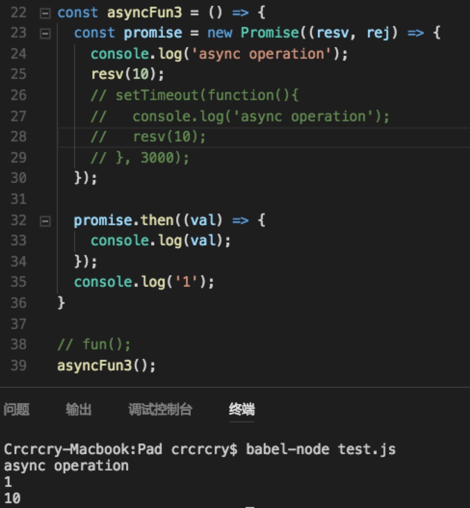
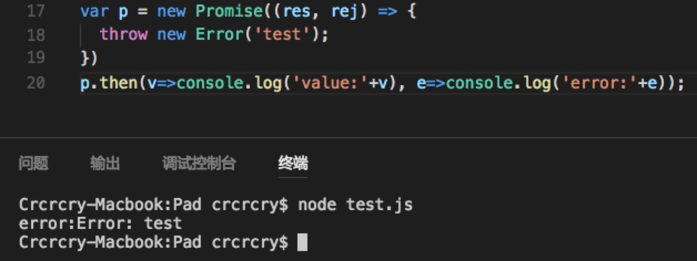
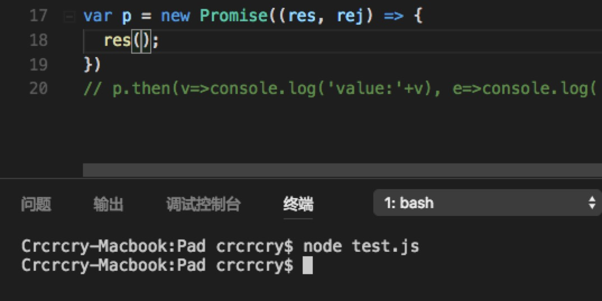
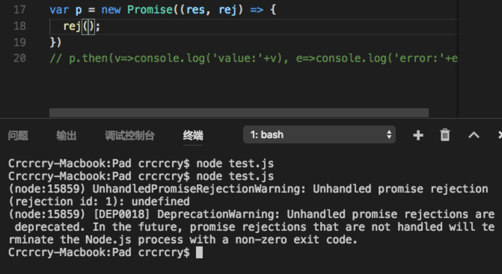
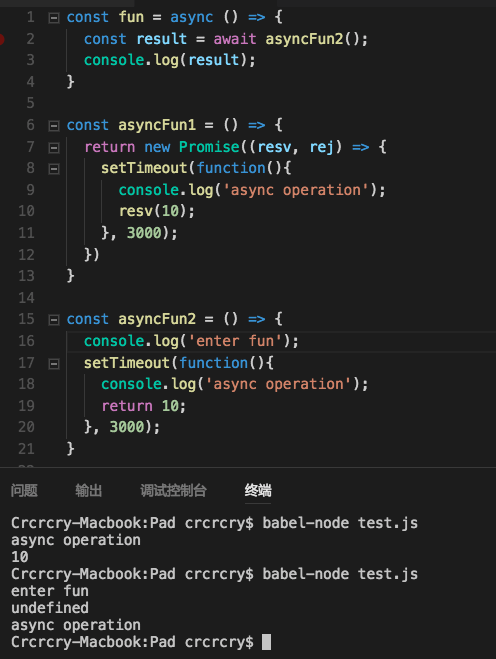
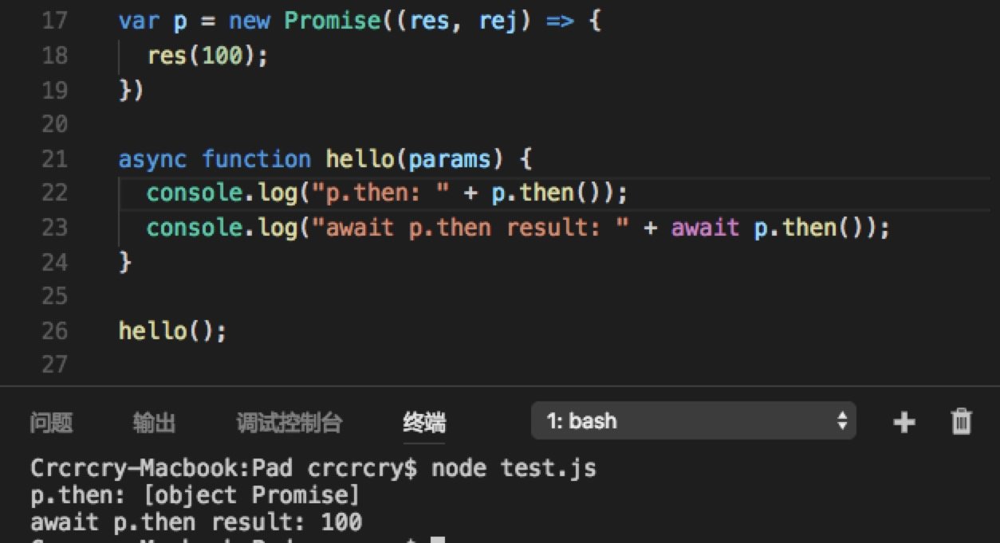
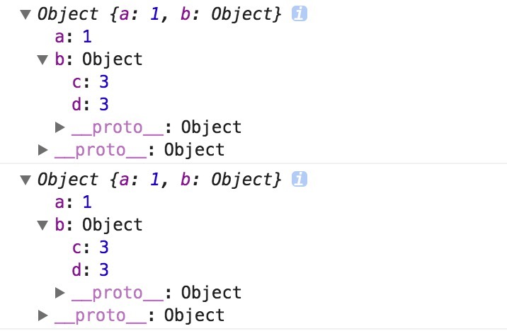
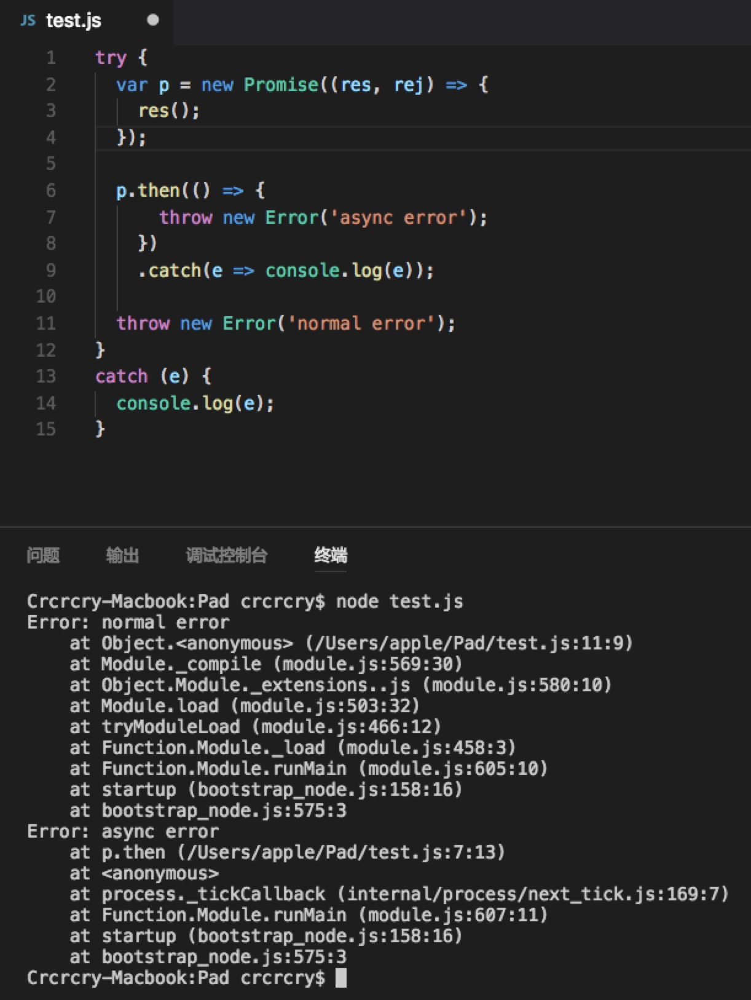
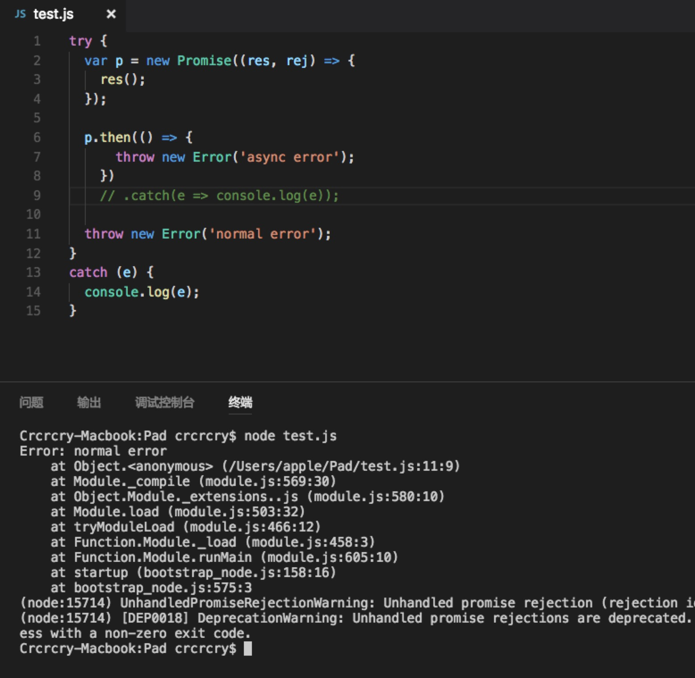
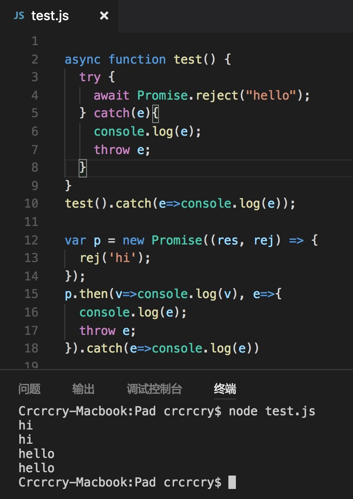

# 一、排坑
## 1.1 关于 JS 异步
- JS 中只有需要等待的才会产生异步代码执行，比如数据库查询、ajax请求。
- 只要在需要等待的操作得到结果的回调中插入自己的回调函数，即可保证函数顺序执行。
- new Promise 的 resolve 和 reject 函数用于改变 Promise 状态。then保证顺序执行。

## 1.2 Promise 原理


- new 一个 Promise 时会立即运行构造函数传入的函数，resolve/reject 时异步改变状态。
- reject 与 错误：
	- Promise 调用 reject 和 resolve 时只是表现它们的状态改变，而不是抛出错误（除非手动 throw new Error），不过 reject 的确是通过 catch（then 中、try ... catch 中、或 Promise.catch 中）来捕获状态的改变。
	- 但 Promise 抛出错误时默认是 reject 状态（除非手动 resolve）。



- Promise 对象的错误具有“冒泡”性质，会一直向后传递，直到被捕获为止。
- 一个 Promise 最好写好 rejectHandler，没有 resolveHandler 不会怎么样，但没有 rejectHandler 会报 warning。




## 1.3 async/await 原理
- await 后跟的实际上都是 Promise 对象。
- await 表达式的返回值实际上是 await 后跟的 Promise 对象 resolve 时传递的参数，再经过封装过的 generator 自动调用 next 返回。
- 换句话说，await 实际上 Promise 和 generator 的语法糖。
- 在下面的例子1中：
	- 第一个函数中，由于 Promise 对象在 setTimeout 时状态仍旧是 pending，没有 resolve，所以没有到 then，await 尚未发挥作用。
	- 第二个函数中，setTimeout 中 return 没有什么意义，函数实际上最后有一个 return null，setTimeout 异步执行去了。
- 在下面的例子2，表现了 async/await、generator/yield、promise 的关系。




## 1.4 \_\_proto\_\_ 与 prototype
- 是什么
	- prototype：显式原型。
	- \_\_proto\_\_：隐式原型，JavaScript 中任意对象都有一个内置属性[[prototype]]，在ES5之前没有标准的方法访问这个内置属性，但是大多数浏览器都支持通过\_\_proto\_\_来访问。ES5 中有了对于这个内置属性标准的Get方法Object.getPrototypeOf().
- 二者的关系
	- 隐式原型指向创建这个对象的函数（constructor）的 prototype。
	- 换句话说，隐式原型指向这个对象的父亲对象，用于表示继承关系。
- 作用是什么
	- 显式原型的作用：用来实现基于原型的继承与属性的共享。换句话说，用于表达一个构造器生产的实例们共有的属性。所以，一个实例是不会有 prototype 的。
	- 隐式原型的作用：构成原型链，用于实现基于原型的继承。举个例子，当我们访问 obj 这个对象中的 xx 属性时，如果在 obj 中找不到，那么就会沿着 \_\_proto\_\_ 依次查找。

## 1.5 关于拓展运算符
- 拓展运算符用于变量拷贝，只能深拷贝第一层，深层是浅拷贝。类似于 Object.assign()。


```javascript
const x = {
	a: 1,
	b: {
		c: 2,
		d: 3,
	}
}
	
const y = {...x}
	
y.b.c++;
console.log(x)
console.log(y)
```



## 1.6 错误处理
- 别人封装好的也是通过 throw new Error() 来手动抛出而已，要习惯抛出错误并 try ... catch 处理，而不是仅仅返回值与信息。
- try ... catch ... finally，finally 一定能执行，不管 try ... catch 做了什么。
- throw 抛出异常能立刻停止代码的运行，除了 finally。直到有一个 catch 来捕捉处理它。如果没有则中断程序执行。
- 关于同步抛出的错误和异步抛出的错误：
	- 同步没啥好说的
	- 异步抛出的错误：
		- try ... catch 代码块已经运行结束了，会导致 catch 捕获不到异步中抛出的错误，只能异步 catch（异步代码，无法在调用时捕获，原因就是在捕获的当时，回调函数并未执行。）。
		- 即通过 await 或者 promise 将异步转化为同步即可正确处理。另外图3两段代码意义相同写法不同，可以加深理解。
	- eg：





## 1.7 new 操作符
- 构造函数的作用是构造一个对象，假设我们有一个构造函数：
	- 构造函数：

		```
		function person(name){
			this.name = name;
		}
		```
	- 当调用 new person('crcrcry') 时，实际做了：
		
		```
		function person(name){
			let this = {};
			this.__proto__ = person.prototype;
			
			this.name = name
			
			return this;
		}
		```
	- 当使用 function person 声明变量时，实际做了如下操作，当然，prototype 可以重写。

		```
		person.__proto__ = Object
		```
		
## 1.8 instanceof 操作符
- obj instanceof Object
	- 实际上是在 obj 的原型链中寻找 Object.prototype。

# 二、尚未理解
