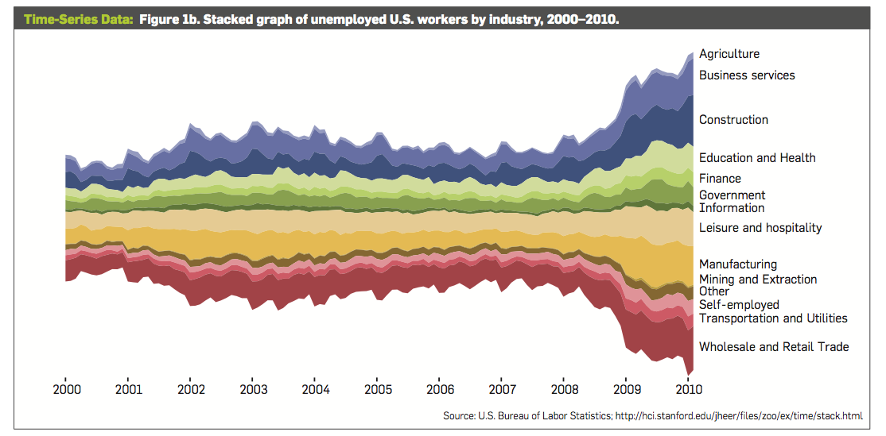

# 一、概述
- 本文通过例子简要展示了一些关于可视化和交互的技术，用于处理一些数据集。
- 很多情况下，简单的数据图表是不够的，我们将关注一些更为复杂的、用于处理复杂数据集的技术。
- “去动物园是去看北极熊、斑马、老虎，而不是为了看猫和狗”。

# 二、Time-Series Data
- Time-Series Data：随着时间变化的数据集。
- example：
	- 金融业：股票、债券价格
	- 科学：温度、污染等级
	- 公共政策：犯罪率

## 2.1 Index Charts
- Index Charts：对于时间序列的数据集，基于选择的索引点，展示其百分比变化的线形图表。
- 需求：数据值没有相对变化趋势重要。
- Example：
	- 一个更关注股票增长速率、而不是股票价格的投资者。
	- 下图为股票相对于 Jan 2005 时间，股价的变化速率。

## 2.2 Stacked Graphs
- Stacked Graphs（or Stream Graphs）：描绘了聚合、叠加形态的图，且支持进入子集
- 需求：对于时间序列的数据集，展示数据聚合、叠加的图。
- 局限性：
	- 不支持负数。
	- 对于不需要求和的数据集没有意义，比如温度。
	- 难以准确的描述趋势，由于它叠加的性质。
- Example：2000——2010，美国失业者的数量，按照行业来区分。

## 2.3 Small Multiples
- Small Multiples：将每个 Time-Series 安置在一个图表上。
- 需求：
	- 需要有一种图表代替 Stacked Graphs，Stacked Graphs 将多个 Time-Series Data 放置在同一个坐标轴。
	- 可能产生部分重叠的曲线、不清晰、且信息量过少。
- 构造形式：any，条形图、饼图、地图...
- Example：类似上一节，2000——2010，美国失业者的数量，按照行业来区分。

## 2.4 Horizon Graphs
- Horizon Graphs：
- 需求：想要同时比较更多的 Time-Series Data，更大的数据密度同时保持分辨率。
- Example：假设正值为蓝负值为红，2000——2010 美国失业率变化。
	- 图一：标准区域图，正负一上一下。
	- 图二：镜像（Mirrors）区域图，正负同区，double 数据密度。
	- 图三：Horizon Graph，类似 Mirrors，但进行分级和分层，再次 double 数据密度。
	- 图四：再次 double。
	- 图五：再次 double。

# 三、Statistical Distributions
- 需求：
	- 离散数据集建模，进行假设检验或未来值预测。
	- 试探性的数据分析，离散数据特征化、分布化。
- 常见的技术：
	- 矩形图：展示了数据值的普遍程度，表现了数据的统计特征（eg：意义、中位数、分界、极端异常值）。
	- othters

# 四、地图

# 五、层次结构

# 六、网络

# 七、结论