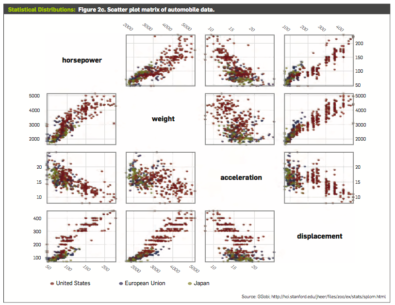

# 一、概述
- 本文通过例子简要展示了一些关于可视化和交互的技术，用于处理一些数据集。
- 很多情况下，简单的数据图表是不够的，我们将关注一些更为复杂的、用于处理复杂数据集的技术。
- “去动物园是去看北极熊、斑马、老虎，而不是为了看猫和狗”。

# 二、Time-Series Data
- Time-Series Data：随着时间变化的数据集。
- example：
	- 金融业：股票、债券价格
	- 科学：温度、污染等级
	- 公共政策：犯罪率

## 2.1 Index Charts
- 定义：对于时间序列的数据集，基于选择的索引点，展示其百分比变化的线形图表。
- 需求：数据值没有相对变化趋势重要。
- Example：
	- 一个更关注股票增长速率、而不是股票价格的投资者。
	- 下图为股票相对于 Jan 2005 时间，股价的变化速率。

## 2.2 Stacked Graphs
- 定义：Stacked Graphs（or Stream Graphs），描绘了聚合、叠加形态的图，且支持进入子集
- 需求：对于时间序列的数据集，展示数据聚合、叠加的图。
- 局限性：
	- 不支持负数。
	- 对于不需要求和的数据集没有意义，比如温度。
	- 难以准确的描述趋势，由于它叠加的性质。
- Example：2000——2010，美国失业者的数量，按照行业来区分。

## 2.3 Small Multiples
- 定义：将每个 Time-Series Data 安置在一个图表上。
- 需求：
	- 需要有一种图表代替 Stacked Graphs，Stacked Graphs 将多个 Time-Series Data 放置在同一个坐标轴。
	- 可能产生部分重叠的曲线、不清晰、且信息量过少。
- 构造形式：any，条形图、饼图、地图...
- Example：类似上一节，2000——2010，美国失业者的数量，按照行业来区分。

## 2.4 Horizon Graphs
- 需求：想要同时比较更多的 Time-Series Data，更大的数据密度同时保持分辨率。
- Example：假设正值为蓝负值为红，2000——2010 美国失业率变化。
	- 图一：标准区域图，正负一上一下。
	- 图二：镜像（Mirrors）区域图，正负同区，double 数据密度。
	- 图三：Horizon Graph，类似 Mirrors，但进行分级和分层，再次 double 数据密度。
	- 图四：再次 double。
	- 图五：再次 double。

# 三、Statistical Distributions
- 需求：
	- 离散数据集建模，进行假设检验或未来值预测。
	- 试探性的数据分析，离散数据特征化、分布化。
- 常见的技术：
	- Histogram：直方图、柱状图。展示了数据值的普遍程度，表现了数据的统计特征（eg：意义、中位数、分界、极端异常值）。
	- others

## 3.1 Stem-and-Leaf Plots
- 定义：
	- Histogram 的一种，数字直方图，茎叶图。
	- 通过第一关键位（主干、茎）来将数据分类。在每类中，通过第二关键位（分枝、叶）将数据值一一展现。
- 作用：既能获得频率分布，也能获得每一个数据。
- Example：在亚马逊土耳其机器人（一种众包网络集市）上，众包完成率分布情况。

## 3.2 Q-Q Plots
- 定义：
	- Quantile-Quantile Plots，Q 代表分位数，用图形的方式比较两个概率分布，比较二者的分位数。图上的点（x,y）反映出第二个分布（y坐标）的分位数和与之对应的第一分布（x坐标）的相同分位数。因此，这条线是一条以分位数间隔为参数的曲线。
	- 分位数，即分位点。例如中位数、四分位数、百分位数。
	- 如果两分布相似，绘制的图将粗略沿着中心对角（y=x曲线）；如果两分布线性相关，绘制的图将呈一条直线。
- 作用：统计分布相比较。
- Example：亚马逊土耳其机器人上相同的一组参与度数据，与均匀分布、正态分布以及一个混合模型分布做比较。

## 3.3 SPLOM（Scatter Plot Matrix）
- 散点图：
	- 定义：数据点在直角坐标系平面上的分布图。反映因变量随自变量变化的大致趋势，据此可以选择适当函数进行拟合。
- 散点图矩阵：
	- 定义：Small Multiples of Scatter Plots
	- 需求：我们分析的对象常常包含多个属性，即多个变量。当欲同时考察多个变量间的相关关系时，若一一绘制它们间的简单散点图，十分麻烦。
	- 作用：利用散点图矩阵来同时绘制各自变量间的散点图，这样可以快速发现多个变量间的主要相关性，这一点在进行多元线性回归时显得尤为重要。
- Examples：
	1. 散点图：人属性数据：身高、体重、性别。
	2. 散点图矩阵：汽车属性数据：马力、重量、速度（加速）、排水量。

---

## 3.4 Parallel Coordinates
- 定义：平行坐标。为了表示在高维空间的一个点集，在N条平行的线的背景下，（一般这N条线都竖直且等距），一个在高维空间的点被表示为一条拐点在N条平行坐标轴的折线，在第K个坐标轴上的位置就表示这个点在第K个维的值。
- 需求：传统的笛卡尔直角坐标系容易耗尽空间，难以表达三维以上数据。需要一种用于对高维几何和多元数据的可视化方式。
- Example：

# 四、Maps
## 4.1 Flow Maps
- 定义：流程图、流图
- 优点：可以通过许多元素进行编码，比如路径点、方向、线宽、颜色...
- Example：拿破仑远征莫斯科

## 4.2 Choropleth Maps
- 定义：地区分布图。数据常常根据地理区域来收集，并通常通过颜色编码在 Choropleth Maps 上呈现。
- 注意事项：
	- 应该使用规范化的数据值而不是原生数据来得出地区密度。
	- 阴影数值的感知会被影响。
- Example：美国各州肥胖比率。

## 4.3 Graduated Symbol Maps
- 定义：符号图，属于 Choropleth Maps 的一种。将符号放置在地图上。
- 优点：
	- 使图更容易理解。
	- 允许更多元的数据（符号有多重可编码方式：尺寸、形状、颜色...）
- Example：美国各州 BMI 比率，即肥胖比率升级版。

## 4.4 Cartograms
- 定义：扭曲了地理区域的形状，因此地理区域可以直接对数据进行编码。
- Example：美国各州肥肠人口数量和比率。

# 五、Hierarchies
- 一些数据集仅仅是数据的水平向收集，但更多的数据集是有纵向层次结构的。甚至有的数据集，即便没有明显的层次结构，通过统计学方法也可以转为有层次结构的数据集。

# 六、网络

# 七、结论